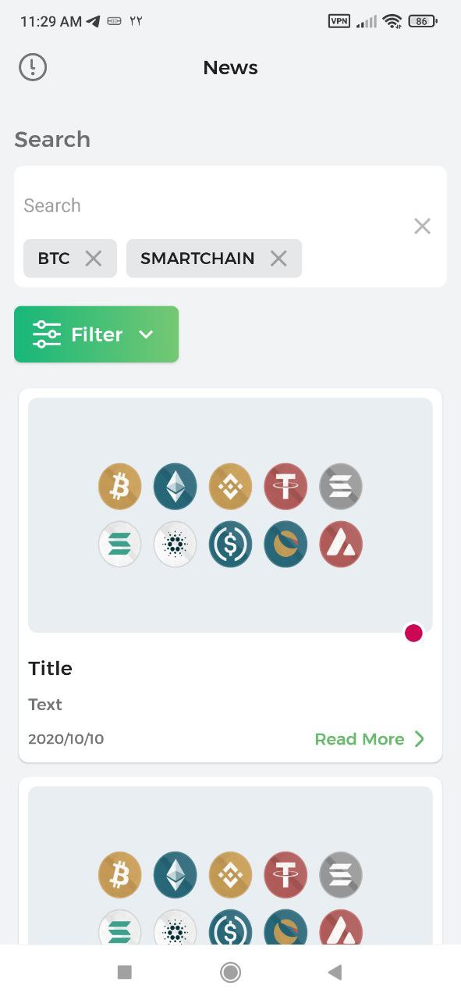
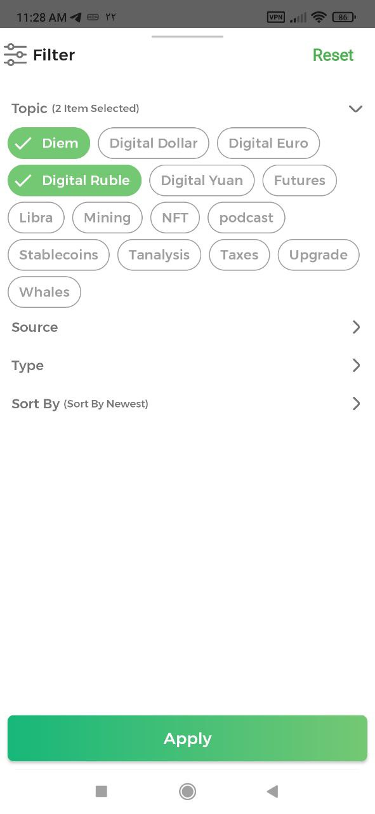

# Crypto News

## Introduction:
Crypto News is an open-source Android Kotlin application that provides users with the latest news about cryptocurrencies.
The app is designed by Mahdi Razzaghi Ghaleh and implemented with an MVI architecture using use-cases. 
To retrieve data from the network, it uses Retrofit, and Dependency Injection is done using Koin. 
Additionally, Glide is employed to load images.

## Give a Star! ⭐
If you like or are using this project to learn or start your solution, please give it a star. Thanks!

## Features:
The app is built on an MVI architecture, which stands for Model-View-Intent. 
This makes it easy to separate the different components of the app and maintain a clean codebase.

The app has several features that users would love, including:

1. Paging: The app uses paging to load news items in batches, reducing the time it takes to load the app.

2. Filtering and Searching: Users can filter and search for news items using different criteria such as keyword, time, or source.

3. API Key: However, it's essential to note that you must add the API key in build.gradle for it to function correctly. 
To get the API key, you can visit `cryptonews-api`.com and follow the instructions provided.

| Main | Filtering |  
| :---: | :---: |
|  |   |  

## Technology and Library Used:
To make the app fast, efficient, and user-friendly, several technologies and libraries were employed. These include:

1. Retrofit: Retrofit is used to retrieve data from the network. It is an HTTP client library for Android and Java that makes it easy to parse JSON data.

2. Koin: Koin is a dependency injection library that makes it easy to declare, inject, and manage dependencies in your app.

3. Glide: Glide is a fast and powerful image loading library that enables images to load seamlessly in the app.

## Conclusion:
Crypto News enables users to stay informed on the latest developments in the cryptocurrency industry. 
Utilising an MVI architecture, paging, filtering, and searching capabilities, the app provides a seamless and friendly user experience. 
With the efficient technologies and libraries employed, such as Retrofit, Koin, and Glide, the app ensures a fast and smooth performance.

  
